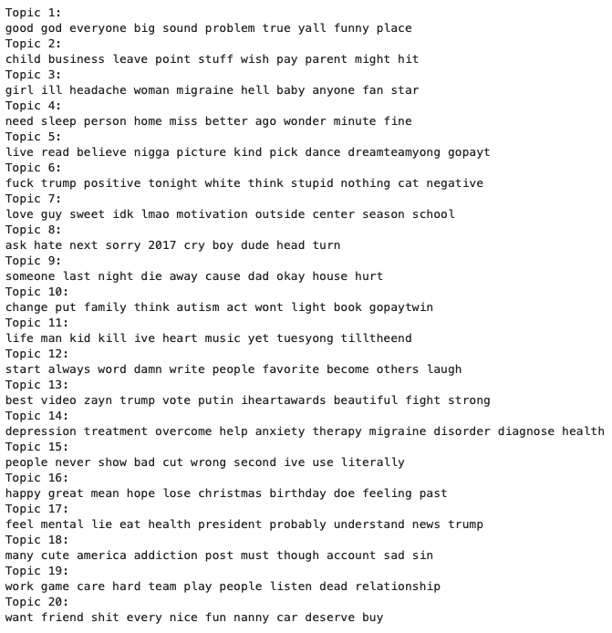
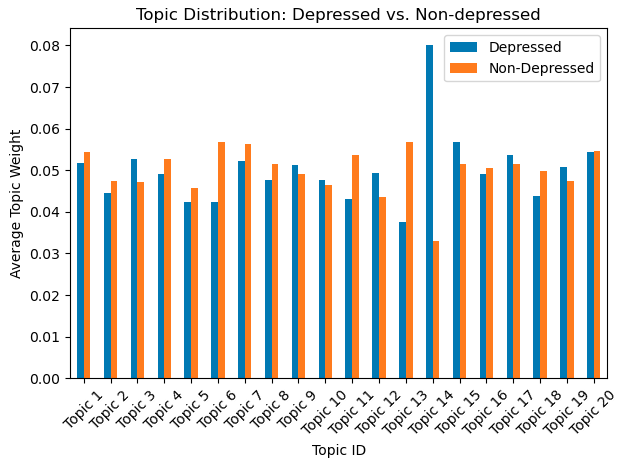

# Tweets

## Table of Contents
- [Introduction](#introduction)
- [Dataset](#dataset)
- [Features](#features)
- [Installation](#installation)
- [Usage](#usage)
- [Program Structure](#program-structure)
- [Contributions](#contributions)
- [Screenshots](#screenshots)
- [License](#license)

## Introduction
This project performs topic modelling on tweets from users labelled as depressed or non-depressed to uncover thematic patterns in language use. Using `Latent Dirichlet Allocation (LDA)`, the project identifies overlapping themes to understand how depression manifests in social media discourse. Emphasis is placed on model interpretability and linguistic analysis over classification accuracy.

The dataset has limited representativeness, as it includes only Twitter users — typically younger and more technologically engaged — and relies on self-identified or algorithmically classified cases of depression, which may not reflect clinically verified diagnoses. As a result, the findings cannot be generalised to the broader population.

This was developed as part of the ICT202 Machine Learning unit at Murdoch University.

## Dataset
This project uses the `Depression: Twitter Dataset + Feature Extraction` dataset, available [here](https://www.kaggle.com/datasets/infamouscoder/mental-health-social-media).


## Features
- **LDA-Based Topic Modelling**: Uses Latent Dirichlet Allocation to discover overlapping linguistic patterns in short texts.
- **Preprocessing Pipeline**: Includes cleaning, lemmatisation, and advanced stop word filtering for optimal topic quality.
- **Model Evaluation**: Supports perplexity and coherence scoring, with configurable topic counts and stop word removal.
- **Visual Interpretability**: Generates plots for topic composition and topic distribution between user groups.

## Installation
### Default Environment
1. Clone the repository:
    ```bash
    git clone https://github.com/mxlodyk/Tweets.git
    ```
2. Navigate to the project directory:
    ```bash
    cd Tweets
    ```
3. Install the required dependencies:
    ```bash
    pip install -r requirements.txt
    ```
### Conda Environment
1. Recreate the environment:
    ```bash
    conda env create -f environment.yml
    ```
2. Activate the environment:
    ```bash
    conda activate ict202_py310
    ```

### Prerequisites
- Python 3.10.x
- pandas
- NumPy
- NLTK
- scikit-learn
- Gensim
- Matplotlib
- seaborn
- Jupyter Notebook

## Usage
1. Launch the program:
    Launch Jupyter Notebook:
    ```bash
    jupyter notebook
    ```
2. Run the topic model:
    Open `topic_model.ipynb` and click "Run All Cells"

## Program Structure
- `data_cleaner.ipynb`: Handles data cleaning, duplicate removal, stop word filtering, and lemmatisation.
- `topic_model.ipynb`: Builds and trains the LDA model, performs perplexity and coherence evaluation, and plots topic distributions.

## Contributions
Contributions are welcome! If you'd like to improve the program or fix any issues, please:
1. Fork the repository.
2. Create a new branch (`git checkout -b feature/your-feature`).
3. Commit your changes (`git commit -m 'Add some feature'`).
4. Push to the branch (`git push origin feature/your-feature`).
5. Open a Pull Request.

## Screenshots
<p float="left">
  
  
</p>

## License
This project is licensed under the MIT License. See the [LICENSE](LICENSE) file for details.